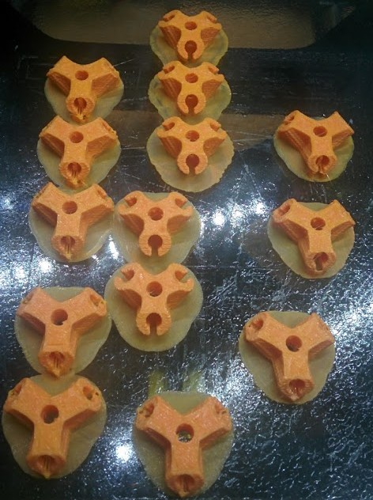

# Poliedros_3D

Estoy trabajando para construir modelos de Poliedros regulares, en concreto he empezado con los [Sólidos platónicos](https://es.wikipedia.org/wiki/S%C3%B3lidos_plat%C3%B3nicos)

## Poliedros

Este [diseño](http://www.thingiverse.com/thing:9203) te permite hacer algunos de los más normales: Tetraedro, Cubo, icosaedro, dodecaedro y alguno más

Al ser polígonos regulares, podemos usar cualquier longitud de varilla, puesto que los ángulos se mantienen.

Yo estoy utilizando varillas de maderas de 5 y 6mm compradas en las bazares, donde vienen unas 10-12 unidades de unos 30cm por algo más de 1€. El problema es que no todas son igual de gruesas y algunas están algo torcidas.

He probado a imprimir los modelos directamente (pensados para varillas de 6mm) y cuesta insertar las varillas de 6mm mientras que las 5mm van sueltas.

Si reescalamos las piezas al 50% podemos usar los típicos palillos de brocheta

Piezas para un cubo 3mm y una de 6mm

Varias piezas recién impresas para tetraedro y cubo de 6mm

Un tetraedro ya montado con varillas de 6mm

## Otras figuras

El siguiente reto es un icosaedro truncado o buckyball (o fullereno C60)

Para ello voy a usar este [modelo](http://www.thingiverse.com/thing:629977/)

El [montaje](https://www.youtube.com/embed/mwJmi6ByF5M) parece sencillo aunque largo

<iframe width="560" height="315" src="https://www.youtube.com/embed/mwJmi6ByF5M" frameborder="0" allowfullscreen></iframe>

## Domos

En este punto sería interesante montar un Domo tamaño grande, para ello podemos aprender del tema con el [enorme tutorial](https://github.com/TecnoLab/domocraft/wiki) del gran @Obijuan

Otro [modelo de domo](http://www.thingiverse.com/thing:2040867/) realizado por @Mecano

## Manos a la obra

Vamos a ir construyendo los Poliedros

### Tetraedro

* 4 [piezas impresas](http://www.thingiverse.com/download:29140)
* 6 varillas

### Cubo o hexaedro

* 8 [piezas impresas](http://www.thingiverse.com/download:29141)
* 12 varillas

### Octaedro

* 6 [piezas impresas](http://www.thingiverse.com/download:29142)
* 23 varillas

TODO

### Dodecaedro

* 20 [piezas impresas](http://www.thingiverse.com/download:29143)
* 30 varillas

TODO

### Icosaedro

* 12 [piezas impresas](http://www.thingiverse.com/download:29144)
* 30 varillas

